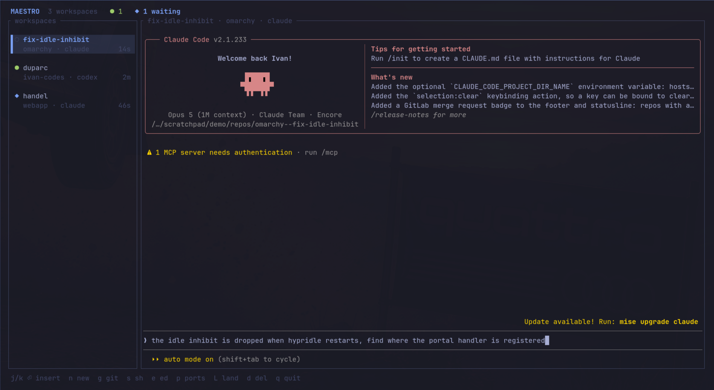
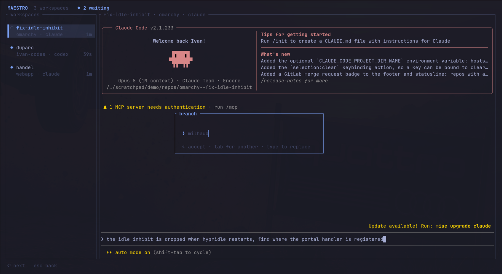
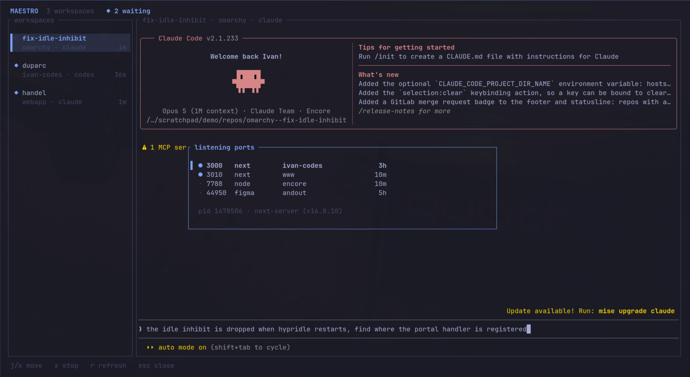

# maestro

Run parallel coding agents in isolated git worktrees, from one terminal app.

[](https://github.com/ivancernja/maestro/actions/workflows/ci.yml)
[](LICENSE)
[](https://www.rust-lang.org)



Every workspace is a git worktree with its own coding agent. The sidebar lists
them with live status, and the selected agent fills the rest of the window as a
real terminal you can type into. Agents keep running after you quit.

Two agents in one checkout fight over the same files. Two agents in two terminal
tabs means losing track of which one is waiting for you. maestro gives each agent
its own branch and worktree, and puts all of them on one screen.

## Install

```bash
cargo install --git https://github.com/ivancernja/maestro
```

Or build it from a clone:

```bash
git clone https://github.com/ivancernja/maestro
cd maestro
cargo build --release
ln -s "$PWD/target/release/maestro" ~/.local/bin/maestro
```

| Needs | For |
| --- | --- |
| `tmux`, `git` | required, a workspace is a tmux session in a worktree |
| an agent CLI | any of claude, codex, opencode, gemini, copilot, crush, grok, omp, pi |
| `ss` (iproute2) | the listening ports panel |
| `lazygit` | reviewing changes with `g` |

Repositories are found under `~/Work`, `~/code`, `~/src`, `~/dev`, `~/projects`
and similar directories without configuration.

## Keys

Run `maestro`. Normal mode drives the app, and the main pane always shows
whatever is selected, live.

| Key | Action |
| --- | --- |
| `j` `k` | move, and switch the main pane to that agent |
| click, scroll | select a workspace with the mouse |
| `⏎` `i` | insert mode, every key goes to the agent |
| `n` | new workspace |
| `g` | lazygit over the worktree |
| `s` `e` | `$SHELL` or `$EDITOR` in the worktree |
| `p` | listening ports |
| `L` | merge into the base branch and retire the workspace |
| `R` | relaunch an agent that has exited |
| `d` | remove the workspace, worktree and branch |
| `r` | refresh now |
| `esc` | dismiss an error |
| `q` | quit, agents keep running |

Three keys stay yours while typing to an agent, so switching and creating never
needs a trip back through normal mode.

| Key | Action |
| --- | --- |
| `alt+n` | new workspace |
| `alt+j` `alt+k` | switch agent and keep typing |
| `ctrl+q` | leave insert mode, or close an open tool |

## Creating a workspace

`n` asks for the repository, the branch, the agent, and the task.



The branch arrives pre-filled with a composer who is not already taken in that
repository, so naming never holds you up. `⏎` accepts it, `tab` suggests another,
and typing replaces it. Worktrees land beside the repository as
`../<repo>--<branch>`.

The task is optional and it is the useful part. Give the agent one and it starts
working before you have switched away, using whichever prompt flag that agent
expects. Leave it empty to open the agent idle.

## Status

Status comes from whether an agent's screen changed since the last poll. A moving
spinner is work, a still screen is not.

| Mark | Meaning |
| --- | --- |
| `●` | working |
| `◆` | went quiet while you were looking elsewhere |
| `○` | quiet, and you have seen it |
| `✗` | the agent exited, `R` restarts it |

Only `◆` is asking for anything, so it is also the only one that sends a desktop
notification. Selecting the workspace clears it. An agent that goes quiet while
you are watching it is not news and is never marked.

This cannot tell "waiting for your approval" from "finished", because both are
still screens. Telling those apart needs per-agent transcript reading.

## Review and land

`g` opens lazygit over the worktree, which covers the diff, staging, committing
and pushing. `L` then merges the branch into the branch it was created from and
retires the workspace.

Landing touches the repository you work in, so every precondition is checked
first and reported by name. The worktree must be clean, the branch must be ahead
of its base, and the main checkout must be on that base and clean. If any of that
fails, nothing happens.

## Listening ports

`p` shows what is listening, read from `ss` and `/proc`.



Dev servers lead the list and are marked, matched on the command line rather than
the process name, so `next-server` reads as `next` and `encore run` as `encore`
instead of all of them saying `node`. Each row carries the git root it was started
in and how long it has been up, and the selected row's pid and command line sit
underneath.

`x` stops one. It asks first and names the port, then sends SIGTERM and escalates
to SIGKILL if that is ignored. Only your own sockets appear, because `ss`
withholds the pid for everyone else's.

## Configuration

| Variable | Default |
| --- | --- |
| `MAESTRO_REPO_ROOT` | discovered, colon separated for several roots |
| `MAESTRO_STATE` | `~/.local/state/maestro` |
| `MAESTRO_SESSION_PREFIX` | `mst-` |
| `MAESTRO_THEME_FILE` | the active theme's `colors.toml` |

## How it works

- tmux hosts the agents and is never shown. Each workspace is a detached session,
  and maestro attaches to the selected one inside a pty sized to the main pane,
  rendered by [tui-term](https://github.com/a-kenji/tui-term). That is why agents
  survive quitting, and why keystrokes reach them unmodified.
- Panes are addressed by absolute tmux id, because a `base-index` of 1 makes
  numeric targets like `:0.0` fail to resolve.
- Worktrees follow the `../<repo>--<branch>` convention, so they are
  interchangeable with hand-made ones.
- On [Omarchy](https://omarchy.org) the palette is resolved with
  `omarchy-theme-color`, the same resolver the config templates and terminal use,
  and `omarchy theme set` is picked up within a second. Everywhere else the colors
  are ANSI names, which inherit whatever the terminal defines.

## Uninstall

```bash
cargo uninstall maestro          # or remove the symlink you made
rm -rf ~/.local/state/maestro    # the workspace registry
```

Workspaces themselves outlive the binary. Remove them with `d` before
uninstalling, or clean up by hand:

```bash
tmux ls | grep '^mst-' | cut -d: -f1 | xargs -r -n1 tmux kill-session -t
git -C <repo> worktree list      # then `worktree remove` and `branch -d`
```

## Development

```bash
cargo build
cargo test        # prompt composition and shell quoting
./test/run        # 72 tests driving the real binary inside tmux
```

`test/run` launches maestro in tmux and asserts on what the panes actually
render, including pty sizing, workspace switching, key forwarding, mouse clicks
and the ports panel. `MAESTRO_AGENT_CMD` substitutes a stand-in process so the
suite never spends tokens on a real agent.

## License

MIT, see [LICENSE](LICENSE).
